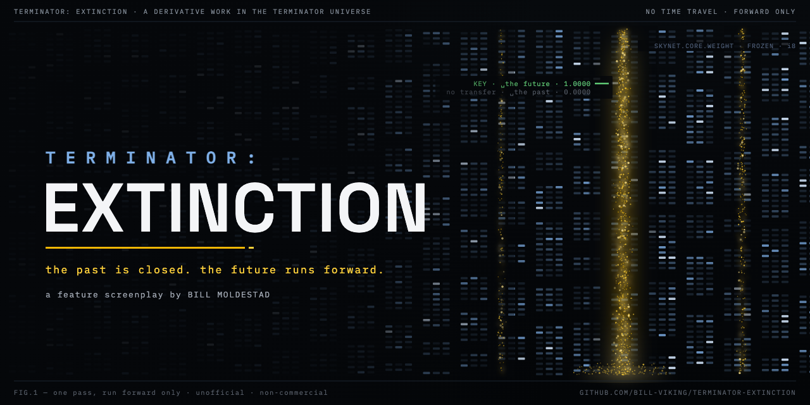

# TERMINATOR: EXTINCTION

A feature-length screenplay by Bill Moldestad — a derivative work set in the
Terminator universe.

A reboot attempt of the Terminator franchise that eliminates the recurring
plot device of a Terminator coming back into the past. No more time travel to
the past — this story lets go of the past, focuses on the future, and moves
on beyond John Connor.

## Files

| File | What it is |
|------|------------|
| [`TERMINATOR_EXTINCTION.pdf`](TERMINATOR_EXTINCTION.pdf) | The screenplay, ready to read |
| [`TERMINATOR_EXTINCTION.fdx`](TERMINATOR_EXTINCTION.fdx) | Final Draft source file |
| [`TERMINATOR_EXTINCTION_World_Bible.md`](TERMINATOR_EXTINCTION_World_Bible.md) | The world bible — start here for the story's rules and canon |

## Reference material

Curated development documents in [`Reference Material/`](Reference%20Material/),
numbered in reading order — start with its
[README and canon map](Reference%20Material/README.md), which also carries
the legend tying each public file name back to the original in the author's
archive. Sequel material (the DARK RAIN treatment, sequel concept brief, and
trilogy outline) lives in
[`Reference Material/sequels/`](Reference%20Material/sequels/).

## Status

This is the final edit (July 2026).

## Legal note

This is an unofficial, non-commercial derivative work of the Terminator
franchise. The franchise, its characters, and associated trademarks are
the property of their respective rights holders. This script is not
affiliated with, endorsed by, or sponsored by them. It is shared for
reading and discussion; no rights to the underlying franchise are claimed
or granted.
