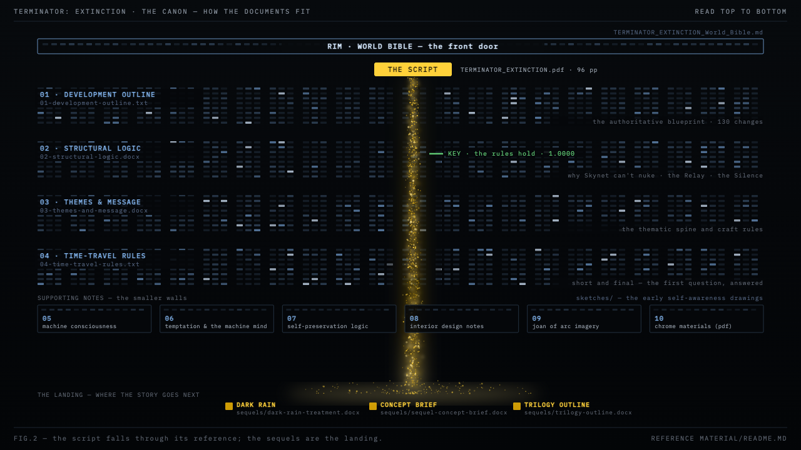

# Reference Material

Curated development documents for **TERMINATOR: EXTINCTION**. Read them in
numbered order: the [World Bible](../TERMINATOR_EXTINCTION_World_Bible.md)
is the front door, the numbered docs are the walls the story falls through,
and `sequels/` is where it lands next.

Files are renamed here for public readability. The **Original name** column
is the file's name in the author's development archive, so the two sets can
always be tied back together.

## The core (read these first)

| # | File | Original name | What it is |
|---|------|---------------|------------|
| — | [`../TERMINATOR_EXTINCTION_World_Bible.md`](../TERMINATOR_EXTINCTION_World_Bible.md) | TERMINATOR_EXTINCTION_World_Bible.md | The world bible — rules, canon, and how it all connects |
| 01 | [`01-development-outline.txt`](01-development-outline.txt) | TERMINATOR_EXTINCTION_v18_11_Development_Outline.txt | The authoritative blueprint (v18.11, 130 tracked changes) |
| 02 | [`02-structural-logic.docx`](02-structural-logic.docx) | TERMINATOR_EXTINCTION_Structural_Logic_v18_11.docx | The causal chain — why Skynet can't nuke, the Relay, the Silence |
| 03 | [`03-themes-and-message.docx`](03-themes-and-message.docx) | TERMINATOR_EXTINCTION_Themes_and_Message.docx | The thematic spine and craft rules |
| 04 | [`04-time-travel-rules.txt`](04-time-travel-rules.txt) | Time_Travel_Logic.txt | Short and final — answers the question every reader asks first |

## Supporting notes

| # | File | Original name | What it is |
|---|------|---------------|------------|
| 05 | [`05-machine-consciousness-notes.docx`](05-machine-consciousness-notes.docx) | ai_consciousness_notes.docx | "It can calculate, but it can't reflect" |
| 06 | [`06-temptation-and-the-machine-mind.txt`](06-temptation-and-the-machine-mind.txt) | Power of temptation and the machine mind.txt | Consciousness as friction |
| 07 | [`07-skynet-self-preservation-logic.txt`](07-skynet-self-preservation-logic.txt) | Skynet Self Preservation Logic.txt | The three-truths-one-lie structure and the deep irony |
| 08 | [`08-skynet-interior-design-notes.txt`](08-skynet-interior-design-notes.txt) | Skynets interior preferences.txt | Production design: "white, not pristine" |
| 09 | [`09-joan-of-arc-imagery-guide.txt`](09-joan-of-arc-imagery-guide.txt) | Joan of Arc Recurring Imagery Guide.txt | Lora's recurring visual motif |
| 10 | [`10-terminator-chrome-materials.pdf`](10-terminator-chrome-materials.pdf) | Terminator Chrome Material Explanation.pdf | Hardware reference |

## Sequels — where the story goes next

| File | Original name | What it is |
|------|---------------|------------|
| [`sequels/dark-rain-treatment.docx`](sequels/dark-rain-treatment.docx) | dark_rain_treatment_lean.docx | The DARK RAIN treatment (film 2) |
| [`sequels/sequel-concept-brief.docx`](sequels/sequel-concept-brief.docx) | Sequel_Concept_Brief.docx | The bridging mechanism; Lora as Joan of Arc (uses the working title "Awakening") |
| [`sequels/trilogy-outline.docx`](sequels/trilogy-outline.docx) | trilogy_outline.docx | The three-film arc |

## Sketches

Early "becoming self-aware" outline drawings, in [`sketches/`](sketches/):

| File | Original name |
|------|---------------|
| `ai-view-on-becoming-sentient.jpg` | AI view on becoming sentient.jpg |
| `ai-view-on-memory-and-self.jpg` | AI view on remembering and memory self.jpg |
| `becoming-self-aware-1.jpg` | Become Self Aware Outline part 1.jpg |
| `becoming-self-aware-2.jpg` | Becoming Self Aware Outline part 2.jpg |
